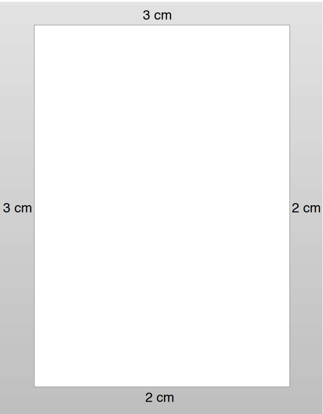
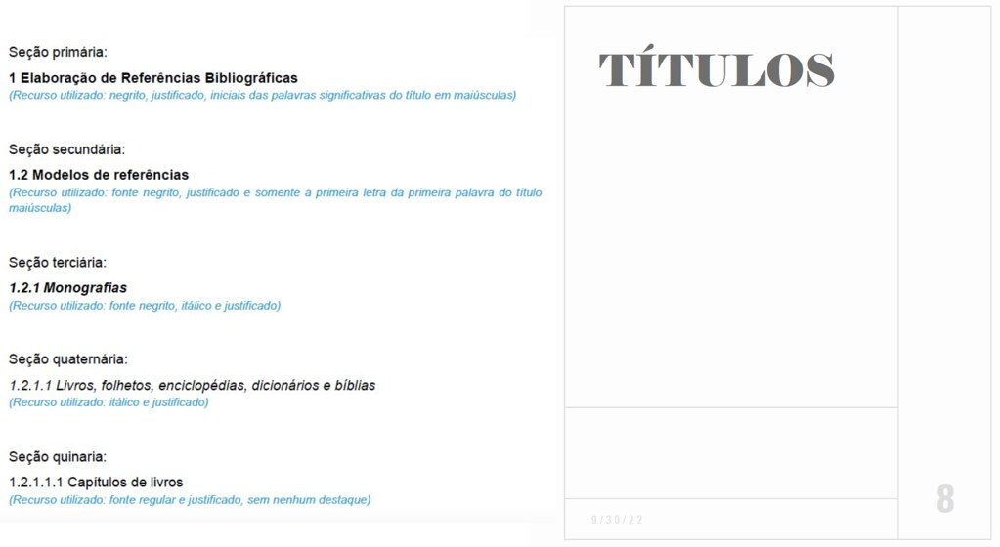

# P1 - Metodologia Científica

Neste capítulo estarão contidos os resumos dos slides da disciplina Metodologia Científica.

## Slides da Aula 06 - "Normas ABNT para Elaboração de Trabalhos Científicos"

### Trabalhos Acadêmicos

#### Definições

* **MONOGRAFIA**:
  * Término do curso de graduação: os estudantes têm o compromisso de elaborar um trabalho mais aprofundado
  * É a exposição exaustiva de um problema ou assunto específico, investigado cientificamente.
  * É elaborada sob coordenação de um(a) orientador(a).
  * Monografia de graduação: objetiva a obtenção do grau de bacharel, licenciado ou tecnólogo
  * Monografia de especialização: objetiva a obtenção do grau de especialista
* **DISSERTAÇÃO DE MESTRADO**
  * Dissertação um tipo de trabalho científico apresentado ao final do curso de pós-graduação, visando obter o título de mestre/mestra.
  * Situa-se entre a monografia de graduação e a tese de doutorado - aborda temas em maior extensão e profundidade do que a primeira e é fruto de reflexão e de rigor científico, próprio da tese de doutorado, mas sendo ainda um treinamento ou iniciação à investigação
* **TESE DE DOUTORADO**
  * Trabalho científico que apresenta o resultado de um estudo científico ou uma pesquisa experimental de tema específico e bem delimitado.
  * Deve ser elaborada com base em investigação original, constituindo-se em real contribuição para a especialidade em questão

#### Regras Gerais de Formatação

|Elemento|Regra de Formatação|
|:--|:--|
|**Papel**|Papel branco, formato A4 (21 cm x 29,7 cm), na posição retrato.|
|**Fonte**|- Arial ou Times New Roman, simples Tamanho 12 para texto e títulos<br>- Cor preta para o texto<br>- Tamanho de fonte 10 para:<br>* citações com mais de três linhas<br>* notas de rodapé<br>* paginação<br>* legendas das ilustrações;<br> * tabelas|
|**Margens**| - Margem esquerda e superior de 3 cm;<br>- Margem direita e inferior de 2 cm<br>-Justificado|
|**Espaçamento**|- 1,5 entre linhas:<br>* Para o texto<br>- Simples:<br>* Para Citações diretas de mais de 3 linhas<br>- notas de rodapé<br>- legendas das ilustrações e das tabelas|
|**Paginação**|- A numeração é colocada a partir da primeira folha da parte textual<br>- Numeração deve ser colocada no anto superior direito|


```{r echo=FALSE, fig.show="hold", out.width="80%", fig.align = "center", fig.cap="Exemplo de formatação das margens de uma página"}

```

#### Títulos das Seções do Documento

* **Títulos com indicativo numérico**: 
  * Alinhados à margem esquerda; e 
  * Devem ser precedidos por seu indicativo em algarismos arábicos (não se deve utilizar algarismos romanos) e dele separado por apenas um espaço.
* **Destacam-se gradativamente**
  * Os títulos das seções, utilizando-se os recursos de negrito, itálico, grifo, maiúsculas e versal (no Word, versalete), no texto e de forma idêntica, no sumário.

```{r echo=FALSE, fig.show="hold", out.width="80%", fig.align = "center", fig.cap="Títulos das Seções do Documento"}

```

#### Estrutura Geral do Trabalho Acadêmico

|Elemento|Regra de Formatação||
|:--|:--|:--|
|**Pré-texto**|- Capa<br>- Folha de Rosto<br>- Ficha Catalográfica<br>- Dedicatória<br>- Agradecimentos<br>- Resumo|<br>Abstract<br>- Keywords<br>- Sumário<br>- Lista de Figuras<br>- Lista de Tabelas<br>- Lista de Abreviações<br>- Apresentação|
|**Texto**|Introdução<br>- Objetivos<br>- Justificativa<br>- Corpo do Trabalho ou Desenvolvimento / Método<br>- Cronograma<br>- Orçamento<br>- Resultados<br>- Conclusões|
|**Pós-Texto**|Referências<br>- Anexos<br>- Índice Remissivo<br>- Glossário|


#### Citações

* Citação é a menção, no texto, de informação extraída de outra fonte;
* Todas as citações do texto devem constar nas Referências;
* Todos os documentos relacionados nas Referências devem ser citados no texto;
* Sistema de chamada autor-data entre parênteses: p. ex.(LEAL, 2022)
* **Tipos de citação**:
  * **citação direta**: transcrição textual literal de parte da obra do autor consultado;
  * **citação indireta**: texto escrito baseado na obra do autor consultado;
  * **citação de citação**: texto escrito em que não se teve acesso ao original.

#### CITAÇÃO DIRETA

##### ATÉ 3 LINHAS

* As citações diretas de **até três linhas** devem estar contidas entre aspas duplas.
* É obrigatória a menção da paginação de onde tal trecho foi extraído.

#### MAIS DE 3 LINHAS

* As citações diretas, no texto, de **mais de três linhas** devem ser destacadas com recuo de 4 cm da margem esquerda, com Letra menor que a do texto, espaçamento simples e sem aspas.
* É obrigatória a menção da paginação de onde tal trecho foi extraído.

#### CITAÇÃO INDIRETA

* Transcrição de pensamentos e conceitos do autor consultado, porém descritos com as próprias palavras de quem está escrevendo.

#### CITAÇÃO DE CITAÇÃO

* Transcrição direta ou indireta de uma obra citada por outro autor, ou seja, a qual não se teve
acesso.
* Indicar o sobrenome do(s) autor(es) do documento não consultado, seguido da data, da
expressão latina apud (significa citado por) e do sobrenome do(s) autor(es) do documento
consultado, data e página.
* OBSERVAÇÃO: Nas REFERÊNCIAS é listada apenas a obra a qual se teve acesso

#### ELEMENTOS ESSENCIAIS

##### COMO CITAR O(S) AUTOR(S) DA INFORMAÇÃO

###### Um Autor

###### Dois Autores

###### Três Autores

###### Mais que Três Autores

###### Autoria Institucional

###### No caso de Leis, Decretos e Outras Normas